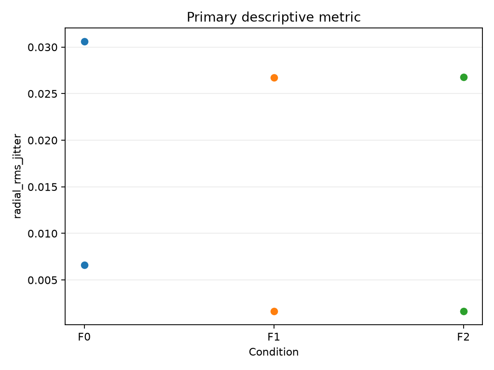
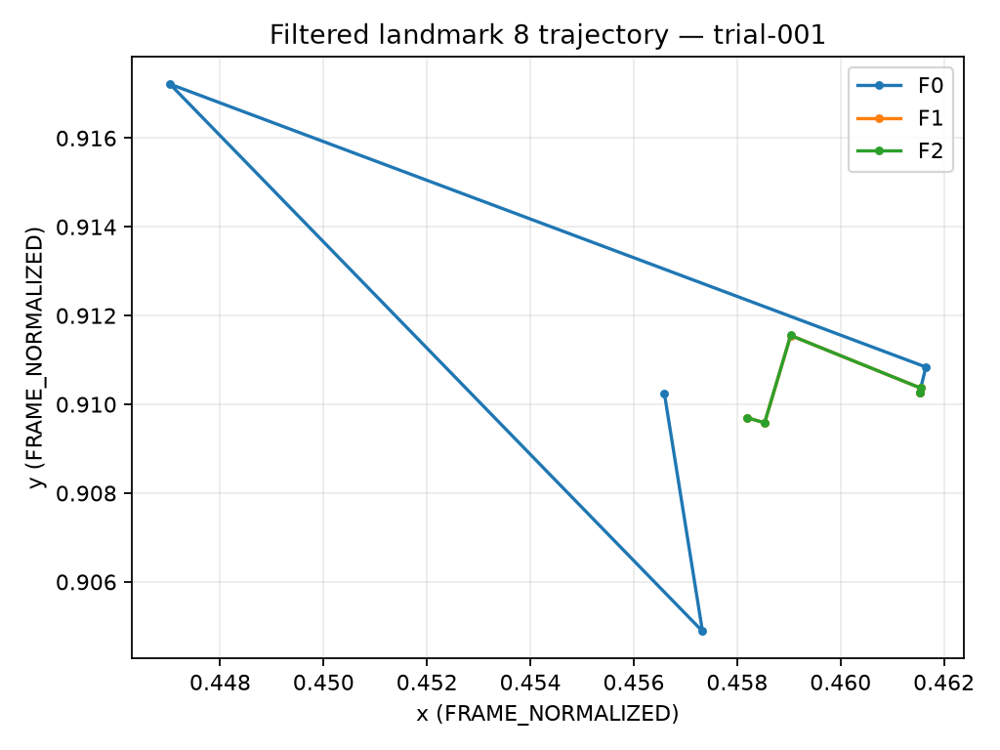
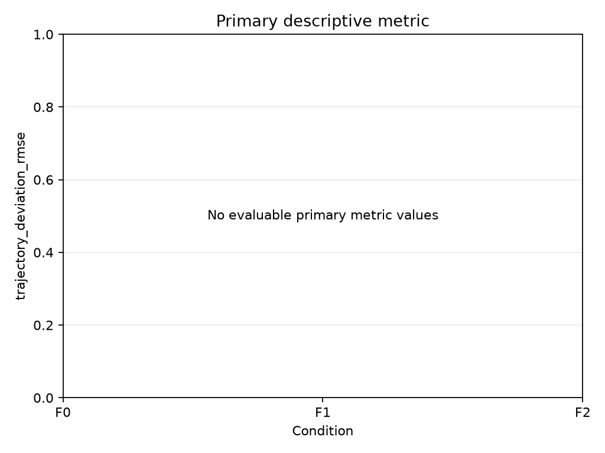
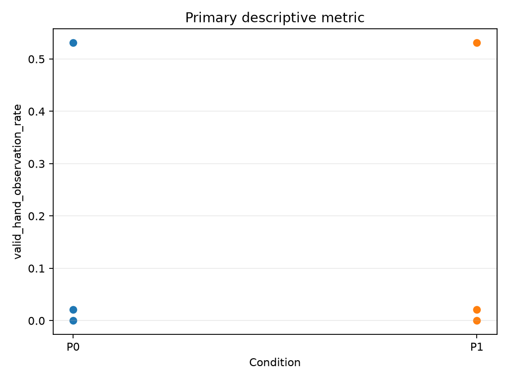
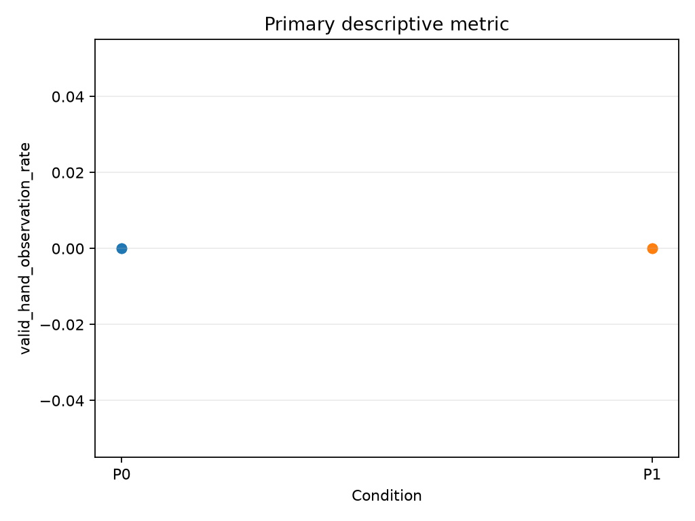
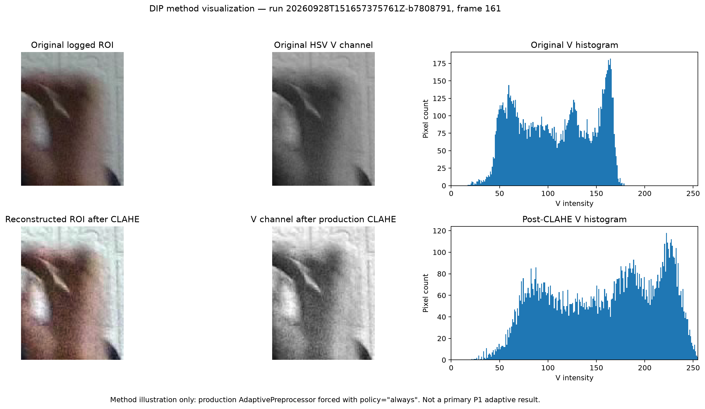

# DIP Touchless STEM — Final Report

## Project Title

**Real-Time Touchless 3D STEM Interaction Using Adaptive Image Preprocessing and Motion Signal Filtering with a Single RGB Camera**

## Abstract

Low-cost touchless interaction using a conventional RGB webcam is affected by illumination variation, landmark jitter, temporary tracking loss, and the trade-off between motion smoothing and responsiveness. This project designs and evaluates a modular Digital Image Processing and temporal signal-processing pipeline for real-time manipulation of rendered 3D STEM content using a single RGB camera.

The implemented pipeline combines stateful Region of Interest management, HSV-based illumination analysis, adaptive CLAHE/bypass preprocessing, MediaPipe Hand Landmarker integration through a project-owned adapter, explicit landmark validity, Raw and 1-Euro-based temporal filtering, tracking-loss and reacquisition handling, normalized pinch gesture detection, bounded interaction mapping, deterministic replay, and structured reproducibility logging.

Three controlled experiment groups were used. A1 compared Raw, canonical fixed 1-Euro, and bounded adaptive 1-Euro filtering for static jitter. Two of three trials produced evaluable paired metrics, and both filtered methods produced lower radial RMS jitter than Raw in those two trials, while fixed and adaptive results were very close. A2 was intended to characterize dynamic responsiveness, but none of its three final trials contained common usable landmarks in the predefined analysis window, so the primary responsiveness metric remained unavailable. Experiment B compared preprocessing bypass with adaptive preprocessing. No improvement in valid-hand-observation rate was observed in the retained normal or low-light recordings; importantly, the adaptive policy remained in the `NORMAL` state and never activated CLAHE during the analyzed frames.

A physical realtime demonstration successfully drove 3D rotation and pinch-based scaling through the complete processing pipeline. The final conclusions are therefore deliberately limited to the recorded evidence and do not claim universal algorithmic superiority.

---

## 1. Introduction

### 1.1 Problem Statement

Touchless interaction using a conventional RGB webcam provides an accessible way to manipulate digital content without requiring dedicated depth cameras, wearable controllers, or specialized sensing hardware. However, practical webcam-based hand interaction is affected by several sources of instability.

Changes in illumination can reduce the reliability of hand-landmark detection. Predicted landmarks may fluctuate even when the hand is approximately stationary. Temporary tracking loss can interrupt the interaction state. At the same time, aggressive temporal smoothing may reduce visible jitter but can also reduce responsiveness to intentional hand motion.

These problems are particularly important in interactive systems because the output of the vision pipeline is directly converted into application commands. Small frame-to-frame landmark fluctuations can produce unintended object movement, while excessive smoothing can make the application feel delayed or unresponsive.

This project therefore investigates a lightweight Digital Image Processing and temporal signal-processing pipeline for real-time touchless interaction with rendered 3D STEM content using a single RGB webcam.

The complete system combines Region of Interest management, illumination analysis, adaptive image preprocessing, external hand-landmark detection, explicit measurement validation, temporal filtering, gesture mapping, renderer-independent interaction state, structured experiment logging, and deterministic replay.

The project does not attempt to create a new neural hand detector or reconstruct metric three-dimensional hand geometry. MediaPipe Hand Landmarker is treated as an external landmark provider. The academic and engineering focus remains on the image-processing, signal-processing, interaction, and reproducibility pipeline around that provider.

### 1.2 Project Objectives

The primary objective is to design, implement, and experimentally evaluate a modular processing pipeline:

```text
RGB Webcam / Recorded Replay
        ↓
Frame + Timing Contract
        ↓
ROI Management
        ↓
Illumination Analysis
        ↓
Adaptive ROI Preprocessing
        ↓
Hand Landmark Provider
        ↓
Measurement Validation
        ↓
Raw / Fixed / Adaptive Temporal Filtering
        ↓
Gesture + Coordinate Mapping
        ↓
InteractionState
        ↓
Rendered 3D STEM Extension
```

The project objectives are to:

1. provide explicit and deterministic frame/timestamp handling;
2. analyze illumination in a stateful Region of Interest;
3. support adaptive CLAHE or preprocessing bypass while preserving detector geometry;
4. isolate MediaPipe behind a project-owned landmark-provider contract;
5. represent missing or invalid measurements explicitly rather than through artificial zero landmarks;
6. implement Raw, canonical fixed 1-Euro, and bounded adaptive 1-Euro temporal paths;
7. handle tracking loss, timestamp discontinuity, reset, and reacquisition safely;
8. convert filtered hand landmarks into bounded rotation and scale interaction commands;
9. demonstrate the resulting signal through rendered 3D STEM interaction; and
10. support reproducible controlled evaluation through deterministic replay, immutable run artifacts, configuration hashing, and automatically regenerated analysis.

The main academic contribution is the DIP and temporal signal-processing pipeline and its controlled evaluation. The rendered 3D application is a demonstration and validation layer rather than the main research contribution.

### 1.3 Research Questions

The project evaluates three research questions.

**RQ1 — Illumination preprocessing**

Under the tested lighting conditions, does ROI-based adaptive illumination preprocessing improve hand-landmark detection/tracking robustness or stability compared with unprocessed input?

**RQ2 — Temporal filtering**

Does the proposed bounded adaptive 1-Euro strategy reduce measured temporal jitter while preserving responsiveness compared with raw landmarks and a canonical fixed 1-Euro baseline?

**RQ3 — Practical interaction**

Can the resulting processed signal support stable real-time touchless manipulation of rendered 3D STEM objects using a single RGB camera under the tested conditions?

These are experimental questions. No project specification or implementation rule assumes that the proposed method must outperform its baselines.

### 1.4 Scope and Non-Goals

The course project is intentionally constrained to a reproducible single-camera system.

Required scope includes RGB webcam acquisition, recorded replay, frame and timestamp contracts, stateful ROI management, HSV illumination analysis, adaptive CLAHE/bypass preprocessing, MediaPipe landmark integration, explicit measurement validity, Raw and 1-Euro temporal filtering, gesture mapping, a rendered 3D interaction extension, structured run logging, controlled evaluation, and automated testing of research-critical behavior.

The project does not attempt to implement:

- metric 3D hand reconstruction;
- physical camera-depth estimation;
- multi-camera fusion;
- multi-user tracking;
- full-body tracking;
- broad object recognition;
- cloud inference;
- a complete VR/AR system;
- a full physics engine; or
- a broad commercial product platform.

The term **3D** refers to interaction with a rendered three-dimensional scene. MediaPipe model-relative landmark `z` is not described as physical camera depth or a metric real-world distance.

### 1.5 Contributions

The project distinguishes existing methods from project-specific integration and observed results.

Its primary contributions are:

1. a modular DIP pipeline combining ROI processing, HSV illumination analysis, adaptive preprocessing, explicit color-space handling, landmark validation, temporal processing, gesture mapping, and reproducible logging;
2. a project-specific bounded adaptive 1-Euro strategy with velocity-dependent bounded beta and an independently bounded final cutoff;
3. a deterministic paired experiment workflow using the same recorded input for compared methods, frozen analysis windows, explicit exclusion rules, run/config identities, and automatically regenerated results; and
4. a functioning touchless 3D STEM prototype driven by the processed hand signal.

MediaPipe, CLAHE, the canonical 1-Euro algorithm, and standard rendering mathematics are existing components or methods and are not presented as inventions of this project.

---

## 2. Theoretical Background

### 2.1 Region of Interest Processing

A Region of Interest identifies the portion of the image currently most relevant to the processing task. In this project, ROI selection allows illumination analysis and preprocessing to focus on the hand region when tracking is available while retaining a safe recovery path when tracking is lost.

The project defines three states:

```text
SEARCHING
TRACKING
COASTING
```

`SEARCHING` uses the full frame. After a valid hand bounding box is available, `TRACKING` uses a padded version of the previous valid hand region. During temporary tracking loss, `COASTING` retains an expanded version of the last valid region for a bounded period. Continued loss or invalid ROI geometry returns the system to `SEARCHING`.

ROI coordinates use full-frame pixel coordinates and are clamped to valid image boundaries.

The detector geometry is intentionally preserved:

```text
select ROI in full frame
        ↓
preprocess only ROI
        ↓
paste processed ROI into same-size full frame
        ↓
run landmark provider on full-size frame
```

This avoids changing normalized landmark-coordinate semantics.

### 2.2 HSV Illumination Analysis

The selected BGR ROI is converted to HSV and illumination descriptors are calculated from the \(V\) channel.

The mean value is:

\[
\mu_V=\operatorname{mean}(V).
\]

The standard deviation is:

\[
\sigma_V=\operatorname{std}(V).
\]

The 10th and 90th percentiles are:

\[
P_{10}(V), \qquad P_{90}(V).
\]

The robust range is:

\[
C_V=P_{90}(V)-P_{10}(V).
\]

Four illumination states are defined:

```text
NORMAL
LOW_LIGHT
LOW_CONTRAST
DIFFICULT
```

To reduce unstable state switching, the baseline uses temporally smoothed brightness and robust-range measurements:

\[
\bar{\mu}_{V,t}
=
\alpha\mu_{V,t}
+
(1-\alpha)\bar{\mu}_{V,t-1},
\]

\[
\bar{C}_{V,t}
=
\alpha C_{V,t}
+
(1-\alpha)\bar{C}_{V,t-1}.
\]

Separate enter and exit thresholds provide hysteresis.

Threshold values are configuration parameters and are not treated as universal definitions of good or bad illumination.

### 2.3 CLAHE-Based Adaptive Preprocessing

The image-preprocessing baseline uses Contrast Limited Adaptive Histogram Equalization on the HSV value channel [2].

The processing sequence is:

```text
BGR ROI
    ↓
HSV
    ↓
V channel
    ↓
CLAHE when enabled
    ↓
HSV reconstruction
    ↓
BGR ROI
    ↓
same-size full-frame reconstruction
```

Three policies are supported:

```text
bypass
always
adaptive
```

`bypass` leaves the ROI semantically unenhanced.

`always` applies CLAHE.

`adaptive` applies CLAHE only when the stabilized illumination state is not `NORMAL`.

The recorded `enhancement_active` value represents whether CLAHE was actually applied, rather than merely whether a difficult illumination state was considered possible.

### 2.4 Hand Landmark Detection

MediaPipe Hand Landmarker is used as an external hand-landmark provider [3].

The project explicitly owns the image and data boundary:

```text
OpenCV BGR frame
        ↓
project preprocessing
        ↓
full-size BGR frame
        ↓
provider adapter
        ↓
BGR → RGB
        ↓
MediaPipe
        ↓
project-owned LandmarkObservation
```

Provider-specific classes do not propagate into downstream filtering, interaction, logging, or rendering modules.

Normalized \(x/y\) coordinates are represented as full-frame normalized coordinates. Provider `z` remains model-relative.

When no accepted per-observation measurement-quality value exists, quality is explicitly marked unavailable. Configuration thresholds or handedness scores are not reinterpreted as tracking confidence.

### 2.5 Canonical 1-Euro Filter

The canonical fixed 1-Euro baseline follows the derivative-filtered formulation described by Casiez, Roussel, and Vogel [1].

For scalar input \(x_t\) with update interval \(\Delta t\):

\[
rate=\frac{1}{\Delta t}.
\]

The raw derivative estimate is:

\[
d_t=(x_t-\hat{x}_{t-1})rate.
\]

Derivative low-pass filtering uses:

\[
\tau_d=\frac{1}{2\pi f_d},
\]

\[
\alpha_d=\frac{1}{1+\tau_d/\Delta t},
\]

\[
\hat d_t
=
\alpha_d d_t
+
(1-\alpha_d)\hat d_{t-1}.
\]

The signal cutoff is:

\[
f_c=f_{min}+\beta|\hat d_t|.
\]

The signal low-pass coefficient is:

\[
\tau=\frac{1}{2\pi f_c},
\]

\[
\alpha=\frac{1}{1+\tau/\Delta t}.
\]

The filtered output is:

\[
\hat{x}_t
=
\alpha x_t
+
(1-\alpha)\hat{x}_{t-1}.
\]

The fixed baseline keeps \(f_{min}\), \(\beta\), and the derivative cutoff constant.

For project landmarks, independent temporal state is maintained for each landmark's \(x/y\) pair. Model-relative `z` is passed through unchanged.

### 2.6 Temporal Filtering for Touchless Interaction

Direct conversion of noisy landmarks into interaction commands may cause unintended motion. Temporal smoothing can reduce this instability, but excessive smoothing may distort intentional movement.

The project therefore evaluates both stability and responsiveness.

Three temporal conditions are defined:

```text
F0 — Raw landmarks
F1 — Canonical fixed 1-Euro
F2 — Proposed bounded adaptive 1-Euro
```

F0 preserves raw temporal measurements.

F1 applies the canonical fixed 1-Euro structure.

F2 retains the same general structure while introducing project-specific bounded adaptation.

Missing measurements are never replaced by artificial zero landmarks. Loss, reset, and reacquisition are handled explicitly so that the first valid frame after reset produces neutral interaction output rather than a sudden motion impulse.

---

## 3. System Design

### 3.1 Overall Architecture

The logical architecture is:

```text
FrameSource
    ↓
FramePacket
    ↓
ROIManager
    ↓
IlluminationAnalyzer
    ↓
AdaptivePreprocessor
    ↓
LandmarkProvider
    ↓
MeasurementValidator
    ↓
TemporalFilter
    ↓
TrackingFrame
    ↓
GestureEngine
    ↓
InteractionState
    ↓
3D STEM Extension
```

Cross-cutting research output is recorded through:

```text
Frame / tracking diagnostics
            ↓
        RunLogger
            ↓
versioned run artifacts
```

The architecture separates acquisition, DIP preprocessing, external tracking, temporal filtering, gesture mapping, logging, analysis, and rendering.

### 3.2 DIP Core and 3D Extension Boundary

The **DIP Core** owns research-critical processing.

The **3D Extension** consumes only the renderer-independent `InteractionState`.

The intended dependency direction is:

```text
domain / contracts
        ↑
capture | preprocessing | tracking | filtering | interaction
        ↑
pipeline / runtime

telemetry reads public Core data
analysis reads run artifacts
extension reads InteractionState
```

The Extension does not access mutable filter, ROI, preprocessing, or MediaPipe internals.

This separation allows algorithm evaluation without requiring the renderer and allows the presentation layer to evolve without redefining experimental semantics.

### 3.3 Realtime and Replay Runtimes

`RealtimeRuntime` supports interactive demonstration using the webcam.

It executes the same Core processing sequence used for replay and exposes the resulting interaction state.

A presentation-only callback may receive a copy of the camera frame plus public tracking and interaction information. Presentation code cannot modify the Core input image or replace research-critical processing.

`ReplayRuntime` is used for deterministic experiments.

It preserves ordered replay input and allows alternative configurations to process the same recorded frames and timestamps.

This matched-source design reduces variation caused by performing separate physical motions for each method.

### 3.4 Frame, Timestamp, and Color-Space Contracts

Each frame carries explicit identity and timing.

Within a run:

- `frame_id` increases monotonically;
- timestamps are finite;
- ordinary continuous filter updates require increasing timestamps;
- `dt` is derived from timestamps rather than assumed from requested FPS.

The baseline color path is:

```text
OpenCV capture / replay
        ↓
BGR uint8
        ↓
BGR → HSV
        ↓
optional CLAHE on V
        ↓
HSV → BGR
        ↓
same-size processed frame
        ↓
BGR → RGB at provider boundary
        ↓
MediaPipe
```

No module silently reinterprets a BGR image as RGB.

### 3.5 Coordinate-Space Contracts

The project distinguishes:

```text
FRAME_PIXEL
FRAME_NORMALIZED
VIEWPORT
NDC
WORLD_RENDER
MODEL_RELATIVE_Z
```

ROI geometry uses `FRAME_PIXEL`.

Provider \(x/y\) coordinates use `FRAME_NORMALIZED`.

Renderer coordinates belong to independent rendering spaces.

MediaPipe `z` remains `MODEL_RELATIVE_Z` and is not labeled physical depth.

### 3.6 Landmark Provider and Measurement Validation

The landmark adapter converts MediaPipe output into a project-owned `LandmarkObservation`.

The observation preserves frame identity, timestamp, status, landmarks, handedness metadata, optional measurement-quality semantics, hand bounding box, and provider identity.

The `MeasurementValidator` determines whether the observation is usable.

No-hand and invalid states remain explicit instead of being represented by zero-valued landmarks.

### 3.7 Temporal Filtering Pipeline

The public modes are:

```text
RAW
ONE_EURO_FIXED
ONE_EURO_ADAPTIVE
```

Each processed frame generates a `TrackingFrame` containing raw and filtered landmarks together with tracking, ROI, illumination, filter, timing, and event diagnostics.

Experimental jitter and responsiveness outcomes are calculated from the recorded landmark trajectories rather than from a diagnostic summary value.

### 3.8 Gesture Mapping and InteractionState

The gesture layer consumes filtered project-domain landmarks.

`InteractionState` contains:

```text
run_id
frame_id
timestamp_s
interaction_valid
pointer_xy
pinch_ratio
pinch_active
rotation_delta
scale_delta
```

The state is independent from a specific renderer.

The 3D Extension may accumulate rotation and scale commands but cannot reinterpret Core filtering or tracking behavior.

### 3.9 Logging and Reproducibility

Configuration precedence is:

```text
repository defaults
        <
experiment profile
        <
explicit CLI overrides
```

At run start, the merged configuration is validated, deterministically serialized, hashed, and frozen.

Representative run artifacts are:

```text
metadata.json
resolved_config.yaml
frames.csv
landmarks.csv
events.csv
```

Metadata preserves run identity, experiment identity, specification version, code revision, schema version, configuration hash, dependency information, model identity/checksum, and source identity where applicable.

---

## 4. Proposed Method

### 4.1 ROI State Management

ROI processing uses:

```text
SEARCHING
    ↓
TRACKING
    ↓
COASTING
    ↓
SEARCHING
```

`SEARCHING` uses the complete frame.

`TRACKING` uses the previous valid hand bounding region plus configurable ratio-based padding.

`COASTING` temporarily retains an expanded version of the last valid region during short tracking loss.

Invalid geometry or prolonged loss returns the system to full-frame search.

### 4.2 Illumination Assessment

For each ROI:

\[
\mu_V=\operatorname{mean}(V),
\]

\[
\sigma_V=\operatorname{std}(V),
\]

\[
C_V=P_{90}(V)-P_{10}(V).
\]

Brightness and robust intensity range are temporally stabilized using EMA values.

The final state is:

```text
low-light   low-contrast   state

false       false          NORMAL
true        false          LOW_LIGHT
false       true           LOW_CONTRAST
true        true           DIFFICULT
```

Separate enter and exit thresholds provide hysteresis.

### 4.3 Adaptive CLAHE Policy

For the adaptive baseline:

```text
NORMAL        → enhancement inactive
LOW_LIGHT     → enhancement active
LOW_CONTRAST  → enhancement active
DIFFICULT     → enhancement active
```

When enabled, CLAHE modifies only the HSV value channel.

The processed ROI is returned to BGR and pasted into the original full-frame geometry.

### 4.4 Raw Baseline — F0

F0 performs no temporal smoothing.

For usable landmark \(j\):

\[
\hat{\mathbf p}_{j,t}
=
\mathbf p_{j,t}.
\]

Tracking, logging, validity, and interaction semantics remain common to the pipeline.

### 4.5 Canonical Fixed 1-Euro — F1

For landmark \(j\):

\[
d_{x,j,t}
=
\frac{x_{j,t}-\hat{x}_{j,t-1}}{\Delta t},
\]

\[
d_{y,j,t}
=
\frac{y_{j,t}-\hat{y}_{j,t-1}}{\Delta t}.
\]

After derivative low-pass filtering, speed is:

\[
v_{j,t}
=
\sqrt{
\hat d_{x,j,t}^{2}
+
\hat d_{y,j,t}^{2}
}.
\]

The fixed cutoff is:

\[
f_{c,j,t}
=
f_{min}
+
\beta v_{j,t}.
\]

The same cutoff filters both \(x\) and \(y\) for one landmark.

Temporal state remains independent between landmarks.

### 4.6 Bounded Adaptive 1-Euro — F2

F2 retains the F1 derivative-filter structure.

With optional velocity limiting:

\[
v_{\beta,j,t}
=
\min(v_{j,t},v_{max}).
\]

Adaptive beta is:

\[
\beta_{j,t}
=
\operatorname{clip}
\left(
\beta_{base}
+
g_v\,v_{\beta,j,t},
\beta_{min},
\beta_{max}
\right).
\]

The primary final F2 comparison does not use invented measurement quality.

When quality adaptation is unavailable or disabled:

\[
f_{min,t}=f_{base}.
\]

Candidate cutoff is:

\[
f^*_{c,j,t}
=
f_{min,t}
+
\beta_{j,t}v_{j,t}.
\]

Final cutoff is independently bounded:

\[
f_{c,j,t}
=
\operatorname{clip}
\left(
f^*_{c,j,t},
f_{c,min},
f_{c,max}
\right).
\]

The output low-pass coefficient is:

\[
\tau=\frac{1}{2\pi f_{c,j,t}},
\]

\[
\alpha=\frac{1}{1+\tau/\Delta t}.
\]

Filtered coordinates are:

\[
\hat{x}_{j,t}
=
\alpha x_{j,t}
+
(1-\alpha)\hat{x}_{j,t-1},
\]

\[
\hat{y}_{j,t}
=
\alpha y_{j,t}
+
(1-\alpha)\hat{y}_{j,t-1}.
\]

The bounded beta mapping and independent final-cutoff constraint are project-specific extensions and are not presented as part of the original canonical 1-Euro method.

### 4.7 Numerical and Timing Safety

An ordinary filter update requires valid finite input and:

```text
dt > 0
d_cutoff > 0
cutoff > 0
finite derivative
finite speed
finite output
```

Timestamp or gap problems enter an explicit reset/discontinuity path.

Recorded event types include:

```text
timestamp_discontinuity
reset_gap_exceeded
loss_gap_exceeded
```

### 4.8 Tracking Loss and Reacquisition

No usable hand measurement causes no artificial filter update.

Zero landmarks are not injected.

On reset or first valid reacquisition, the interaction transition is neutral:

```text
rotation_delta = (0.0, 0.0)
scale_delta = 0.0
pinch_active = false
interaction_valid = false
```

This prevents an acquisition frame from generating a sudden movement.

### 4.9 Pointer-Based Rotation

For filtered pointer:

\[
p_t=(x_t,y_t),
\]

\[
\Delta x=x_t-x_{t-1},
\qquad
\Delta y=y_t-y_{t-1}.
\]

The continuous deadzone is:

\[
D(a,z)=
\begin{cases}
0,&|a|\le z\\
\operatorname{sign}(a)(|a|-z),&|a|>z.
\end{cases}
\]

Yaw is:

\[
\Delta yaw
=
\operatorname{clip}
\left(
g_rD(\Delta x,z_r),
-\Delta r_{max},
+\Delta r_{max}
\right).
\]

Pitch is:

\[
\Delta pitch
=
\operatorname{clip}
\left(
-g_rD(\Delta y,z_r),
-\Delta r_{max},
+\Delta r_{max}
\right).
\]

### 4.10 Scale-Normalized Pinch Detection

Thumb-index distance is:

\[
d_p
=
\|p_{index}-p_{thumb}\|_{xy}.
\]

Hand scale is:

\[
s_h
=
\|p_{scale-a}-p_{scale-b}\|_{xy}.
\]

Normalized pinch ratio is:

\[
r_p
=
\frac{d_p}
{\max(s_h,\epsilon)}.
\]

Pinch hysteresis is:

```text
inactive → active when r_p < pinch_on
active → inactive when r_p > pinch_off
otherwise retain previous state
```

where:

\[
0\le pinch_{on}<pinch_{off}.
\]

### 4.11 Scale Command

For continuously active pinch:

\[
\Delta r_p
=
r_{p,t}-r_{p,t-1}.
\]

Scale command is:

\[
\Delta s
=
\operatorname{clip}
\left(
g_sD(\Delta r_p,z_s),
-\Delta s_{max},
+\Delta s_{max}
\right).
\]

Pinch activation, release, reset, and invalid frames are scale-neutral.

### 4.12 Method Summary

The complete method is:

```text
RGB frame
    ↓
frame/timestamp validation
    ↓
stateful ROI
    ↓
HSV illumination descriptors
    ↓
EMA + hysteresis classification
    ↓
adaptive CLAHE or bypass
    ↓
same-size BGR reconstruction
    ↓
MediaPipe landmark provider
    ↓
measurement validation
    ↓
F0 / F1 / F2
    ↓
loss/reset/reacquisition safety
    ↓
normalized gesture mapping
    ↓
InteractionState
    ↓
rendered 3D STEM interaction
```

---

## 5. Experimental Methodology

### 5.1 Experimental Design

The final controlled evaluation contains three experiment groups:

```text
A1 — Static temporal stability
A2 — Dynamic responsiveness characterization
B  — Illumination robustness
```

The evaluation is descriptive.

No inferential statistical test is included in the final course baseline.

The experiment protocol, metrics, source groups, analysis window, and exclusion policy were defined before interpretation of the final outcomes [4], [5].

### 5.2 Recorded Replay and Pairing

Algorithm comparisons use deterministic recorded replay rather than separately repeated live-camera motion.

For temporal filtering:

```text
one recorded source
        ↓
   ReplayRuntime
   ↙    ↓    ↘
  F0    F1    F2
```

For preprocessing:

```text
one recorded source
        ↓
   ReplayRuntime
      ↙    ↘
     P0    P1
```

The same source content and predefined analysis window are therefore used within a paired trial.

This design reduces motion/content variation between compared methods.

### 5.3 Acquisition Configuration and Final Source Groups

The retained final recordings use nominal acquisition settings of:

```text
camera index:       0
requested width:    640
requested height:   480
requested FPS:      30
recorded format:    MJPG AVI
recorded duration:  12 s
settle time:        3 s
```

Preprocessing is not applied during source recording.

The final analysis window is:

```text
start: 2.0 s
end:   10.0 s
```

The same window is used for all compared methods within a trial.

Three source groups were recorded.

#### `static_normal`

Three recordings:

```text
trial-001
trial-002
trial-003
```

The hand is approximately stationary under normal room illumination.

These recordings are reused for A1 and B-normal.

#### `dynamic_normal`

Three recordings:

```text
trial-001
trial-002
trial-003
```

The index fingertip is moved repeatedly in an approximately horizontal left-right trajectory between visual reference points.

The motion is not treated as physical ground truth.

#### `static_lowlight`

Three recordings:

```text
trial-001
trial-002
trial-003
```

The setup approximately preserves the static-normal geometry while reducing ambient/front illumination.

The retained recordings are labeled:

```text
low-light-room
```

A total of nine unique recorded source videos are therefore used.

### 5.4 Experiment A1 — Static Temporal Stability

A1 compares:

```text
F0 — Raw
F1 — canonical fixed 1-Euro
F2 — bounded adaptive 1-Euro
```

Preprocessing is held constant at P1 for all three temporal conditions.

The primary metric is:

```text
radial_rms_jitter
```

The evaluated trajectory is:

```text
landmark:         8
stage:            filtered
coordinate space: FRAME_NORMALIZED
```

For \(N\) common usable frames:

\[
J_{RMS}
=
\sqrt{
\frac{1}{N}
\sum_i
[
(x_i-\bar{x})^2
+
(y_i-\bar{y})^2
]
}.
\]

Planned comparisons are:

```text
F0 vs F1
F0 vs F2
```

No required percentage improvement is predefined.

### 5.5 Experiment A2 — Dynamic Responsiveness

A2 uses the same temporal profiles:

```text
F0
F1
F2
```

The primary metric is:

```text
trajectory_deviation_rmse
```

F0 is the reference trajectory.

For common usable frames:

\[
D_{RMSE}
=
\sqrt{
\frac{1}{N}
\sum_i
[
(x_{m,i}-x_{F0,i})^2
+
(y_{m,i}-y_{F0,i})^2
]
},
\]

where \(m\) is F1 or F2.

The evaluated trajectory again uses:

```text
landmark:         8
stage:            filtered
coordinate space: FRAME_NORMALIZED
```

The measurement characterizes deviation from the Raw trajectory. It is not interpreted as physical tracking accuracy, physical ground-truth error, or sensor-to-photon latency.

### 5.6 Experiment B — Illumination Robustness

Experiment B compares:

```text
P0 — preprocessing bypass + Raw temporal path
P1 — adaptive ROI preprocessing + Raw temporal path
```

Temporal filtering is held at F0 so that preprocessing and temporal filtering are not changed simultaneously.

The primary metric is valid hand-observation rate:

\[
R_{valid}
=
\frac{N_{usable}}
{N_{analyzed}},
\]

where an observation is usable when tracking status is `VALID` or `REACQUIRED`.

Normal and low-light source groups are evaluated separately.

### 5.7 Paired Metric Availability

A1 and A2 require common usable landmark frame IDs across F0, F1, and F2.

If a trial contains no common usable landmarks in the predefined analysis window:

```text
metric = unavailable
reason = no_common_usable_frames
```

The trial remains part of the final experiment record.

It is not:

- removed because of poor tracking;
- replaced with a new favorable recording;
- assigned numeric zero;
- assigned a fabricated result; or
- evaluated using a post-hoc alternative analysis interval.

Recorded trial count and evaluable trial count are reported separately.

This rule does not change Experiment B. If analyzed frames exist but no usable hand observations occur, the valid-hand-observation rate may legitimately be zero.

### 5.8 Exclusion Policy

A complete final trial may be excluded only for predefined technical failures such as:

- unreadable/corrupted recorded source;
- invalid replay timestamps that prevent correct execution;
- failure of required paired frame/timestamp invariants due to a source/runtime problem; or
- complete camera/source acquisition failure.

The following are not valid exclusion reasons:

- poor tracking;
- `NO_HAND` frames;
- high jitter;
- an unfavorable method comparison;
- noisy output that makes a method look worse; or
- selecting a different interval after observing the result.

No retained final source was replaced because of an unfavorable outcome.

### 5.9 Reproducibility Record

Final experiment identity preserves, where available:

```text
experiment ID
trial ID
run ID
source identity
source SHA-256
analysis window
resolved configuration
configuration hash
specification version
code revision
log schema version
Python/dependency information
provider/model identity
model SHA-256
analysis revision
```

Analysis is regenerated from machine-readable run artifacts rather than from manually typed metric values.

---

## 6. Results

### 6.1 A1 — Static Temporal Stability

Three A1 source trials were recorded.

Two produced evaluable paired primary metrics.

| Trial | Common usable frames | F0 Raw | F1 Fixed 1-Euro | F2 Adaptive 1-Euro |
|---|---:|---:|---:|---:|
| trial-001 | 5 | 0.0066075842 | 0.0016284495 | 0.0016290706 |
| trial-002 | 0 | unavailable | unavailable | unavailable |
| trial-003 | 128 | 0.0305971417 | 0.0267044614 | 0.0267533003 |

`trial-002` remains in the final record with:

```text
no_common_usable_frames
```

In both evaluable trials, F1 and F2 produced lower radial RMS jitter than F0.

However, F1 and F2 were extremely close to one another.

The first evaluable trial also contained only five common usable frames, so that result provides weak descriptive evidence by itself.

The retained A1 static-jitter figure is:



The retained trajectory visualization is:



These results support a limited observation that temporal filtering reduced measured static jitter relative to Raw in the two evaluable retained trials. They do not establish population-level superiority.

### 6.2 A2 — Dynamic Responsiveness

Three A2 source trials were recorded.

The number of evaluable paired trials was:

```text
0
```

All three retained trials produced:

```text
no_common_usable_frames
```

Diagnostic behavior was:

```text
trial-001:
    all 360 replay frames NO_HAND

trial-002:
    all 360 replay frames NO_HAND

trial-003:
    one VALID raw frame at frame 33,
    outside the predefined 2.0–10.0 s analysis window
```

Within the predefined A2 analysis windows, no common usable F0/F1/F2 landmarks were available.

The planned trajectory-deviation RMSE therefore could not be calculated.

The source recordings were not replaced, and the analysis window was not modified after observing the failure.

The generated A2 evidence explicitly records the unavailable outcome:



Consequently, the final experiment does not provide quantitative evidence of the responsiveness side of the intended jitter-versus-responsiveness comparison.

### 6.3 Experiment B — Normal Illumination

Three normal-light trials were evaluated.

Each condition used 241 analyzed frames per trial.

| Trial | P0 Bypass | P1 Adaptive |
|---|---:|---:|
| trial-001 | 0.0207468880 | 0.0207468880 |
| trial-002 | 0.0000000000 | 0.0000000000 |
| trial-003 | 0.5311203320 | 0.5311203320 |

P0 and P1 produced the same primary valid-hand-observation rate in every retained normal-light trial.

The generated evidence is:



### 6.4 Experiment B — Low-Light Condition

Three low-light trials were evaluated.

Each condition again used 241 analyzed frames per trial.

| Trial | P0 Bypass | P1 Adaptive |
|---|---:|---:|
| trial-001 | 0.0000000000 | 0.0000000000 |
| trial-002 | 0.0000000000 | 0.0000000000 |
| trial-003 | 0.0000000000 | 0.0000000000 |

No usable hand observation was recorded in the predefined low-light analysis windows for either P0 or P1.

The generated evidence is:



### 6.5 Adaptive Illumination Activation Audit

A key diagnostic result is required to interpret Experiment B.

For all analyzed P1 frames in B-normal:

```text
illumination state = NORMAL
enhancement_active = False
```

For all analyzed P1 frames in B-lowlight:

```text
illumination state = NORMAL
enhancement_active = False
```

Each group contained 723 analyzed P1 frames across its three trials.

Therefore, CLAHE was never activated by the adaptive P1 policy during the analyzed frames.

The equality between P0 and P1 must not be interpreted as direct evidence that CLAHE itself is ineffective.

The experiment instead shows that, under the retained recordings and resolved configuration, the adaptive activation policy did not activate its CLAHE branch and did not improve the primary valid-hand-observation rate.

### 6.6 DIP-Focused Visual Evidence

A selected DIP-focused visual example is retained as:



The purpose of this evidence is to demonstrate the implemented image-domain preprocessing path and its image-level effect.

An image-domain contrast change alone is not interpreted as evidence of downstream tracking improvement unless the tracking metric supports that conclusion.

### 6.7 Physical Realtime Demo

The main physical behavior smoke run was:

```text
run_id:
g7-demo-20260929-190838

processed_frames:
4947

shutdown:
clean
```

During this run, the following physical behaviors were exercised:

```text
index-fingertip rotation
pinch-based scaling
reset
hand loss
reacquisition
presentation status display
clean shutdown
```

An occasional hand-like false-positive detection was observed around the face/background and caused a small unintended cube rotation.

This behavior is retained as a known limitation rather than hidden by post-hoc tracking-threshold changes.

A second post-commit verification run established the exact final demo execution identity:

```text
run_id:
g7-demo-20260929-192030

processed_frames:
1188

shutdown:
clean

code_revision:
6a87dc50f9d3920ed9fd39a2669e266be00f9735
```

At execution time, the runtime-recorded revision matched repository `HEAD`.

This demonstrates that the final interactive application executed successfully using an immutable identified code revision. It does not demonstrate that F2 or P1 is universally superior to its baseline.

---

## 7. Discussion

### 7.1 RQ1 — Illumination Preprocessing

RQ1 asks whether ROI-based adaptive illumination preprocessing improves hand-landmark detection/tracking robustness or stability under the tested lighting conditions.

The primary Experiment B metric was available for every final normal and low-light trial.

No improvement in valid-hand-observation rate was observed between P0 and P1.

In normal illumination, P0 and P1 produced identical results in all three trials.

In the low-light source group, both methods produced zero valid-hand-observation rate in all three trials.

However, these values require an important qualification.

The adaptive P1 policy classified all analyzed frames as `NORMAL`, including frames from sources recorded and labeled as `low-light-room`. As a result, `enhancement_active=False` throughout the analyzed P1 data.

P1 therefore did not execute CLAHE during the primary Experiment B comparisons.

The final evidence consequently supports only the following interpretation:

> Under the retained final sources and resolved configuration, the adaptive preprocessing policy did not improve the measured valid-hand-observation rate, and its CLAHE branch did not activate during the analyzed frames.

The experiment does not establish that CLAHE itself would be ineffective if deliberately activated under the same image content.

The result also exposes an important system limitation: the illumination-state thresholds used by the final configuration did not classify the retained low-light recordings as difficult enough to trigger adaptive enhancement.

This activation-policy behavior is a useful negative result because it identifies where future improvement should focus rather than attributing the failure incorrectly to the contrast-enhancement operation.

### 7.2 RQ2 — Temporal Filtering

RQ2 asks whether the proposed bounded adaptive 1-Euro strategy reduces temporal jitter while preserving responsiveness compared with Raw and a canonical fixed 1-Euro baseline.

The final evidence answers only part of this question.

For A1 static stability, two of three trials produced evaluable paired measurements.

In both evaluable trials:

```text
F1 jitter < F0 jitter
F2 jitter < F0 jitter
```

The fixed and adaptive results were very close.

Therefore, the retained A1 evidence is consistent with the expected role of temporal low-pass filtering: both F1 and F2 produced lower measured radial RMS jitter than the unsmoothed Raw baseline in the two evaluable trials.

The evidence does not demonstrate a meaningful static-jitter advantage of F2 over F1.

The responsiveness component cannot be evaluated quantitatively from the final A2 source set.

All three dynamic trials produced no common usable landmarks within the predefined analysis window, so the planned trajectory-deviation RMSE was unavailable.

It would be methodologically incorrect to replace those sources after observing the result, move the analysis window, treat unavailable metrics as zero, or select an alternative favorable subset.

Therefore the final project cannot claim that F2 demonstrated a complete jitter-versus-responsiveness advantage over F0 or F1.

The strongest evidence-bounded RQ2 conclusion is:

> F1 and F2 reduced measured static jitter relative to F0 in the two evaluable A1 trials, but the final experiment did not provide the required A2 responsiveness measurement. A complete jitter-versus-responsiveness superiority claim is therefore unsupported.

### 7.3 RQ3 — Practical Touchless Interaction

RQ3 asks whether the processed signal can support real-time touchless manipulation of rendered 3D STEM objects using one RGB camera.

The physical realtime demonstration provides practical evidence for this question.

The full path:

```text
webcam
→ preprocessing
→ landmark provider
→ validation
→ temporal filtering
→ gesture mapping
→ InteractionState
→ rendered 3D object
```

executed successfully during retained live runs.

The final application supported index-fingertip-driven object rotation and thumb-index pinch-based scale interaction.

Hand loss, reacquisition, reset, status presentation, and clean shutdown were exercised.

This establishes that the implemented signal pipeline can drive practical realtime touchless interaction under the observed demo conditions.

The demo does not establish universal tracking reliability or prove that F2 or P1 is superior to alternative configurations.

The observed face/background false-positive also shows that practical robustness remains imperfect.

### 7.4 Jitter–Responsiveness Trade-Off

A central motivation for the 1-Euro framework is the trade-off between stability during slow movement and responsiveness during faster intentional movement.

A1 provides limited evidence for the stability side of this trade-off.

F1 and F2 both reduced measured static jitter compared with Raw in the two evaluable trials.

However, A2 provides no evaluable responsiveness metric.

The intended trade-off therefore cannot be fully characterized from the final controlled data.

This limitation is especially important when interpreting the proposed F2 adaptation. Although F2 is designed to increase beta with speed while bounding its output, the existence of this mechanism does not itself prove that the final implementation achieved a better practical stability/responsiveness balance.

That conclusion requires measured responsiveness evidence.

### 7.5 Failure Analysis

The final project intentionally retains several failures rather than removing them from the evidence.

#### A1 unavailable trial

`trial-002` contained no common usable F0/F1/F2 landmark frame in the predefined analysis window.

The trial remains in the record.

#### A2 complete metric unavailability

The first two A2 sources produced `NO_HAND` for all 360 replay frames.

The third produced only one valid Raw landmark frame outside the primary analysis window.

This suggests that the primary problem occurred before temporal comparison could be evaluated.

The raw usable-frame sets were identical across F0/F1/F2 within each trial, so the A2 failure is not evidence that one temporal filter uniquely caused frame misalignment.

#### Low-light tracking failure

All three low-light trials produced zero valid-hand-observation rate.

This demonstrates that the retained low-light recordings were challenging for the final provider/configuration combination.

#### Illumination policy failure to activate

Despite the low-light acquisition label, the runtime illumination classifier remained `NORMAL` in the analyzed frames.

This prevented the intended adaptive preprocessing branch from being exercised in Experiment B.

#### Realtime false-positive

During the physical demo, an occasional face/background region was interpreted as hand-like input and produced a small unintended rotation.

This demonstrates that practical landmark-provider false-positive behavior can propagate through an otherwise safe downstream interaction pipeline when the provider reports a usable hand.

### 7.6 Limitations and Threats to Validity

The final evaluation has several limitations.

First, each source group contains only three recordings. The evidence is therefore descriptive and does not support population-level inference.

Second, A1 contains only two evaluable paired trials.

Third, one of the two evaluable A1 trials contains only five common usable frames.

Fourth, all three final A2 trials lack the common usable landmarks required for the primary responsiveness metric.

Fifth, all three low-light B trials have zero valid-hand-observation rate.

Sixth, the adaptive illumination classifier remained `NORMAL` during the analyzed Experiment B frames, preventing direct evaluation of CLAHE-active P1 against bypass.

Seventh, camera auto-exposure and auto-white-balance state were not independently verified for the retained final sources and therefore remain recorded as `unknown`.

Eighth, the physical realtime demo showed an occasional hand-like false-positive around the face/background.

Ninth, the system uses a single RGB camera and does not measure metric physical hand depth.

Tenth, the landmark detector is an external provider, so provider-specific failure behavior affects downstream availability.

Eleventh, the final results are descriptive. No inferential statistical test, confidence interval, p-value, or population-level effect claim is made.

Twelfth, the experiment results apply only to the retained sources, resolved configurations, model asset, and code revisions. Different cameras, backgrounds, users, lighting, provider versions, thresholds, or model files may produce different outcomes.

### 7.7 Future Work

The most important future work is evidence improvement rather than adding unrelated system complexity.

For RQ1, future evaluation should first ensure that the intended illumination conditions actually cross the frozen activation criteria or should explicitly compare `always` CLAHE against bypass as a separately defined experiment. This would separate the effect of the enhancement operation from the effectiveness of the illumination classifier.

For RQ2, new dynamic recordings should be acquired using a predefined procedure designed to maintain reliable hand visibility throughout the analysis interval. The experiment design should remain frozen before inspecting the new outputs.

A stronger study could include more repeated trials, additional sessions or participants where appropriate, more diverse backgrounds and cameras, and stronger ablation.

Provider false positives could be investigated through improved validation or additional project-owned plausibility checks, but such changes would constitute a new behavior revision and would require new experimental evaluation.

Commercial development after the course project could additionally address packaging, accessibility, privacy/security hardening, device compatibility, calibration, and user experience. These are future product-development concerns rather than requirements of the final course baseline.

---

## 8. Conclusion

This project implemented a complete modular Digital Image Processing and temporal signal-processing pipeline for touchless interaction with rendered 3D STEM content using a single RGB webcam.

The system includes stateful ROI management, HSV illumination analysis, adaptive CLAHE/bypass preprocessing, MediaPipe hand-landmark integration, explicit measurement validity, Raw and 1-Euro temporal-processing paths, bounded adaptive filtering, safe loss/reacquisition handling, normalized pinch interaction, renderer-independent `InteractionState`, deterministic recorded replay, structured run logging, reproducible analysis, and a realtime 3D demonstration.

The final evidence produces deliberately limited conclusions.

For **RQ1**, adaptive preprocessing did not improve the measured valid-hand-observation rate in the retained normal or low-light trials. However, the adaptive illumination policy remained `NORMAL` and never activated CLAHE during the analyzed P1 frames. The result therefore evaluates the final adaptive policy under the retained configuration, not the effectiveness of actively applied CLAHE in general.

For **RQ2**, the two evaluable A1 trials showed lower static radial RMS jitter for both fixed and adaptive 1-Euro filtering than for Raw landmarks. F1 and F2 were very close. The required A2 responsiveness metric was unavailable for all three final dynamic trials, so the project cannot claim that F2 demonstrated a complete stability-versus-responsiveness advantage.

For **RQ3**, physical realtime runs demonstrated that the complete pipeline can drive touchless 3D object rotation and pinch-based scaling with a single RGB webcam under the observed conditions. An occasional false-positive interaction was retained as a practical limitation.

The strongest final contribution is therefore not a claim of universal algorithmic superiority. It is the implementation of a clear, modular, testable, and reproducible DIP interaction architecture together with controlled experiment tooling that preserves both favorable and unfavorable outcomes.

The final submission deliberately limits its conclusions to evidence that was actually recorded.

---

## References

[1] G. Casiez, N. Roussel, and D. Vogel, “1€ Filter: A Simple Speed-based Low-pass Filter for Noisy Input in Interactive Systems,” *Proceedings of the SIGCHI Conference on Human Factors in Computing Systems (CHI 2012)*, pp. 2527–2530, 2012. DOI: 10.1145/2207676.2208639.

[2] K. Zuiderveld, “Contrast Limited Adaptive Histogram Equalization,” in *Graphics Gems IV*, P. S. Heckbert, Ed., 1994, pp. 474–485. DOI: 10.1016/B978-0-12-336156-1.50061-6.

[3] F. Zhang, V. Bazarevsky, A. Vakunov, A. Tkachenka, G. Sung, C.-L. Chang, and M. Grundmann, “MediaPipe Hands: On-device Real-time Hand Tracking,” arXiv:2006.10214, 2020.

[4] **DIP Touchless STEM — Canonical Specification Set v1.2.** Internal project technical documentation: `00_GOVERNANCE.md`, `01_MASTER_SPEC.md`, `02_ARCHITECTURE_AND_CONTRACTS.md`, `03_ALGORITHM_AND_EXPERIMENTS.md`, `04_IMPLEMENTATION_TESTING_GUIDE.md`, and `05_PROJECT_STATUS_AND_ROADMAP.md`.

[5] **DIP Touchless STEM — G7 Final Controlled Evaluation Plan.** Frozen internal experiment protocol used for the final A1, A2, and Experiment B evaluation.

## Appendix A — Final Experiment Summary

### A.1 A1 Static Temporal Stability

```text
Experiment:
G7-A1-STATIC

Primary metric:
radial_rms_jitter

Profiles:
F0
F1
F2

Recorded trials:
3

Evaluable trials:
2
```

| Trial | Common usable frames | F0 | F1 | F2 |
|---|---:|---:|---:|---:|
| trial-001 | 5 | 0.0066075842 | 0.0016284495 | 0.0016290706 |
| trial-002 | 0 | unavailable | unavailable | unavailable |
| trial-003 | 128 | 0.0305971417 | 0.0267044614 | 0.0267533003 |

### A.2 A2 Dynamic Responsiveness

```text
Experiment:
G7-A2-DYNAMIC

Primary metric:
trajectory_deviation_rmse

Recorded trials:
3

Evaluable trials:
0

Unavailable reason:
no_common_usable_frames
```

Diagnostic summary:

```text
trial-001:
360 / 360 NO_HAND

trial-002:
360 / 360 NO_HAND

trial-003:
one VALID raw frame outside primary analysis window
```

### A.3 Experiment B — Normal

```text
Experiment:
G7-B-NORMAL

Primary metric:
valid_hand_observation_rate

Analyzed frames per condition/trial:
241
```

| Trial | P0 | P1 |
|---|---:|---:|
| trial-001 | 0.0207468880 | 0.0207468880 |
| trial-002 | 0.0000000000 | 0.0000000000 |
| trial-003 | 0.5311203320 | 0.5311203320 |

### A.4 Experiment B — Low Light

```text
Experiment:
G7-B-LOWLIGHT

Primary metric:
valid_hand_observation_rate

Analyzed frames per condition/trial:
241
```

| Trial | P0 | P1 |
|---|---:|---:|
| trial-001 | 0.0 | 0.0 |
| trial-002 | 0.0 | 0.0 |
| trial-003 | 0.0 | 0.0 |

### A.5 Illumination Activation Audit

```text
B-normal P1:
723 analyzed frames
illumination state = NORMAL
enhancement_active = False

B-lowlight P1:
723 analyzed frames
illumination state = NORMAL
enhancement_active = False
```

---

## Appendix B — Reproducibility Identity

### B.1 Canonical Specification

```text
specification:
canonical-v1.2
```

### B.2 Final Live Demo Execution Identity

```text
run_id:
g7-demo-20260929-192030

processed_frames:
1188

shutdown:
clean

executed code_revision:
6a87dc50f9d3920ed9fd39a2669e266be00f9735

config_hash:
ecfaeb11725d9a289b8b6e71a7650a9be5b90fbfb65e5775fe14e13ff5b83a08

model_filename:
hand_landmarker.task

model_sha256:
fbc2a30080c3c557093b5ddfc334698132eb341044ccee322ccf8bcf3607cde1
```

At execution time:

```text
runtime code_revision == repository HEAD
```

The exact code executed by the primary final live-demo verification is therefore:

```text
6a87dc50f9d3920ed9fd39a2669e266be00f9735
```

### B.3 Provenance-Recording Documentation Commit

A later documentation commit records the final demo identity:

```text
7d62e934fed05470a1e738ea958ce0578fab8723
docs: record final demo identity
```

This documentation revision has a different role from the code revision executed by the final demo.

Later README, report, packaging, merge, or tagging commits are not expected to equal the executed demo revision.

### B.4 Physical Behavior Smoke

```text
run_id:
g7-demo-20260929-190838

processed_frames:
4947

shutdown:
clean
```

Observed behavior included:

```text
rotation
pinch / scale
reset
hand loss
reacquisition
presentation status
clean shutdown
```

Observed practical limitation:

```text
occasional face/background hand-like false-positive
→ small unintended object rotation
```

### B.5 Selected Final Evidence

```text
submission/evidence/a1_static/
    metrics.csv
    provenance.json
    static_jitter.png
    trajectories.csv
    trajectory_xy.png

submission/evidence/a2_dynamic/
    metrics.csv
    provenance.json
    responsiveness_unavailable.png

submission/evidence/b_normal/
    metrics.csv
    provenance.json
    valid_hand_rate.png

submission/evidence/b_lowlight/
    metrics.csv
    provenance.json
    valid_hand_rate.png

submission/evidence/dip_visual/
    dip_clahe_frame161.json
    dip_clahe_frame161.png
```

The submission evidence is intended to preserve the traceability chain:

```text
claim
→ metric
→ regenerated analysis output
→ run / trial identity
→ resolved configuration
→ code / model / schema revision
→ recorded source
```
